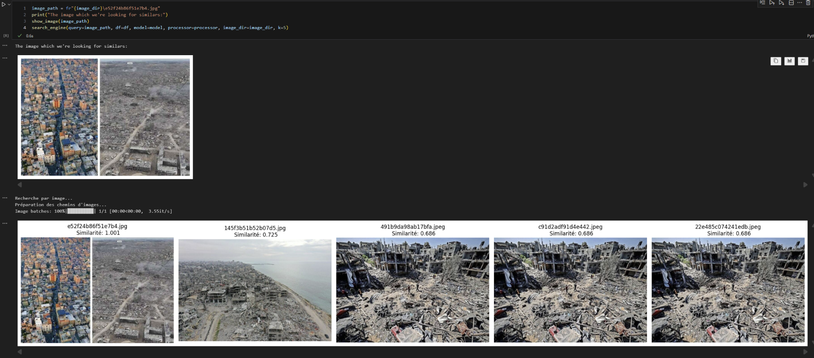

# Image Search Engine (CLIP)

A lightweight, reproducible **semantic image search pipeline** using a SOTA **CLIP embeddings**.  
It downloads images from URLs, computes their vector representations, and lets you search by **text**, **image**, or **precomputed embeddings**.

## Examples

### Text → Image search
Example query: `"Netanyahu is committing a genocide"`

<p align="center">
  
</p>

---

### Image → Image search
Example query: aerial destruction photo (Gaza, 2024)

<p align="center">
  
</p>
---

##  Features
- **Parallel download** with retries + error logging (`parallel_download`, `download_with_retry`)
- **SOTA CLIP embeddings** (`laion/CLIP-ViT-H-14-laion2B-s32B-b79K` )
- **Reusable parquet files** for fast reloads
- **Text → Image** and **Image → Image** semantic search
-  Simple visualization utilities (`show_image`, `search_engine`)

---

## Datasets (examples)
1. **10 septembre** — ~41,942 image URLs  
2. **Reconnaissance de la Palestine** — ~5,055 image URLs  

> Only URLs are stored in the repo — images are downloaded locally.

---

## Project Structure
image_search_engine/
│
├─ assets/
│   ├─ image_search_text.png
│   ├─ image_search_image.png
├─ img_urls/ # {subject}.csv files
├─ img_data/ # downloaded images (ignored)
├─ img_embeddings/ # parquet embeddings
├─ .env
├─ .gitignore
│
├─ helper_functions.py
├─ main.ipynb
├─ README.md
└─ requirements.txt


data/img_data/ is inside **.gitignore**


## Quick Start

```bash
# install
pip install -r requirements.txt

# run main notebook
1 main.ipynb
